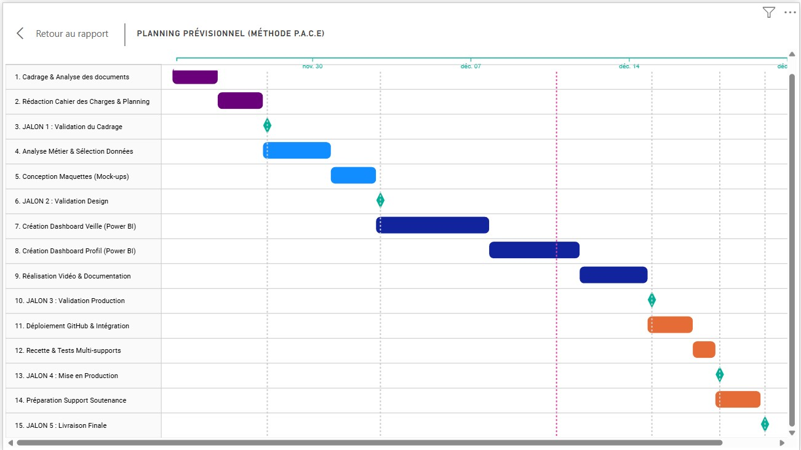

# Planification du Projet (Diagramme de Gantt)

## 1. Stratégie de Pilotage
Le projet est structuré sur une période de 4 semaines, du **24 novembre au 20 décembre 2025**. Cette planification rigoureuse assure la livraison de l'ensemble des fonctionnalités dans le respect de l'enveloppe horaire allouée (70h).

L'approche méthodologique retenue est le **P.A.C.E.** (Plan, Analyze, Construct, Execute), divisant le projet en 4 phases distinctes ponctuées par **5 jalons décisionnels**.

## 2. Calendrier des Jalons (Milestones)
Ces dates clés marquent la validation des livrables et autorisent le passage à la phase suivante :

* **Jalon 1 : Validation du Cadrage** (28/11/2025)
* **Jalon 2 : Validation Conception & Design** (03/12/2025)
* **Jalon 3 : Validation Production Data** (15/12/2025)
* **Jalon 4 : Mise en Production (Déploiement)** (18/12/2025)
* **Jalon 5 : Livraison Finale & Clôture** (20/12/2025)

---

    

## 3. Détail des Phases (Méthodologie P.A.C.E.)

### Phase 1 : P - PLAN (Planifier & Cadrer)
* **Période :** 24/11 - 28/11 (5 jours)
* **Jalon inclus :** **Jalon 1**
* **Objectif Conseil :** Sécuriser le périmètre. Avant toute action technique, il est impératif d'aligner la compréhension du besoin avec les attentes stratégiques du client (Aéroworld).
* **Travail effectué :**
    * Analyse critique du dossier de candidature et des contraintes techniques.
    * Structuration de la démarche via une carte mentale (Work Breakdown Structure).
    * Rédaction des spécifications fonctionnelles pour éviter les dérives hors-périmètre.
* **Livrables de la phase :** Cahier des charges fonctionnel, Planning prévisionnel.
* **Gestion des délais :** Marge de sécurité de 2 jours intégrée pour absorber les itérations de validation initiales.

### Phase 2 : A - ANALYZE (Analyser & Concevoir)
* **Période :** 28/11 - 03/12 (4 jours ouvrés)
* **Jalon inclus :** **Jalon 2**
* **Objectif Conseil :** Traduire le besoin métier en solution visuelle. Cette phase de conception (Design) permet de valider l'ergonomie et les indicateurs clés (KPI) avant tout développement coûteux.
* **Travail effectué :**
    * **Analyse Métier :** Étude des enjeux Data d'Aéroworld (Maintenance prédictive, Flux R&D) pour proposer des contenus pertinents.
    * **Maquettage (UX/UI) :** Création de "filaires" (mock-ups) pour les tableaux de bord. Cela permet de figer la disposition des graphiques et la navigation utilisateur.
* **Livrables de la phase :** Document d'analyse des besoins, Maquettes graphiques des tableaux de bord.
* **Gestion des délais :** Phase courte mais intense. Un chevauchement avec la fin de la phase 1 assure la fluidité.

### Phase 3 : C - CONSTRUCT (Construire & Développer)
* **Période :** 04/12 - 15/12 (12 jours)
* **Jalon inclus :** **Jalon 3**
* **Objectif Conseil :** Garantir la robustesse technique. C'est le cœur de la production, où la rigueur technique prime pour assurer la fiabilité des données présentées.
* **Travail effectué :**
    * **Intégration Data :** Connexion aux sources de données et nettoyage (ETL).
    * **Développement BI :** Création des mesures calculées (DAX) et assemblage des visuels interactifs sur Power BI (Veille & Profil).
    * **Pédagogie :** Réalisation de la vidéo tutorielle et rédaction de la documentation pour assurer le transfert de compétences.
* **Livrables de la phase :** Tableaux de bord fonctionnels (Power BI), Vidéo tutorielle, Documentation technique.
* **Gestion des délais :** Cette phase étant la plus risquée techniquement, un tampon de 3 jours est prévu pour gérer les éventuels bogues ou difficultés d'intégration.

### Phase 4 : E - EXECUTE (Exécuter & Livrer)
* **Période :** 16/12 - 20/12 (5 jours)
* **Jalons inclus :** **Jalon 4** & **Jalon 5**
* **Objectif Conseil :** Soigner la finition et la posture. La qualité perçue dépend de cette dernière étape d'intégration et de préparation orale.
* **Travail effectué :**
    * **Mise en Production :** Déploiement du site et des projets sur GitHub (**Jalon 4**).
    * **Recette (QA) :** Tests d'affichage sur différents supports (Mobile, Tablette) pour garantir l'accessibilité.
    * **Préparation Orale :** Construction du pitch de soutenance et entraînement pour incarner la posture de consultant attendue (**Jalon 5**).
* **Livrables de la phase :** Site Portfolio en ligne, Repository GitHub complet, Support de présentation.
* **Gestion des délais :** La fin de projet est dense avec deux jalons rapprochés. La planification rigoureuse des phases précédentes est cruciale pour aborder cette étape sereinement.

---

> **Jason ZBAKH** - Candidat Chef de Projet Data