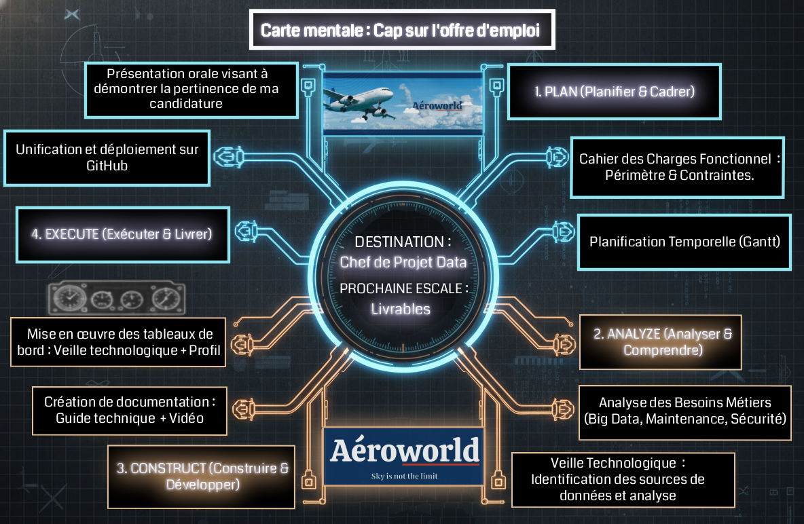

# Candidature - Aéroworld

---

    

---
 
Bienvenue sur l'espace dédié à ma candidature pour le poste de **Data Analyst - Chef de Projet** proposé par Aéroworld.

---

### 🗺️ Plan pour rejoindre Aéroworld

Cette visualisation a pour but de matérialiser la stratégie de pilotage du projet. Conçue comme un véritable "plan de vol", elle a comme objectif principal de rejoindre l'entreprise Aéroworld.

La prochaine escale au sein du parcours de candidature est la création des livrables spécifiques à cette offre.

Afin de répondre à l'impératif demandé, j'ai choisi de structurer la démarche autour de la méthodologie **P.A.C.E.** (*Plan, Analyze, Construct, Execute*) :

    

* **PLAN (Planifier & Cadrer) :** Définition du périmètre et planification des jalons.
* **ANALYZE (Analyser & Comprendre) :** Étude approfondie des besoins métiers d'Aéroworld et conception de solutions.
* **CONSTRUCT (Construire & Développer) :** Phase de production des tableaux de bord interactifs, création de la documentation et enregistrement d'une vidéo de démonstration pédagogique. 
* **EXECUTE (Exécuter & Livrer) :** Unification des livrables, déploiement sur GitHub puis tests de conformité.

## 📂 Structure des Livrables

### 1. [Cahier des Charges Fonctionnel](./Cahier_des_charges/)
Il définit le périmètre fonctionnel, les choix techniques ainsi que les spécifications techniques détaillées pour garantir un livrable conforme aux attentes.

### 2. [Planification & Suivi](./Diagramme_de_gantt/)
Le pilotage temporel du projet, du cadrage initial à la livraison finale. Cette section justifie l'ordonnancement des tâches et définit les dates d'échéance des jalons.

### 3. [Analyse Stratégique & Métier](./Analyse_des_besoins/)
Une étude approfondie de l'écosystème Aéroworld, identifiant les besoins métiers ainsi que les leviers de performance par la Data.

### 4. [Documentation - Préparation des données](./Documentation–Préparation_des_données.pdf)
Guide technique, conçu pour les utilisateurs sous environnement Windows, détaille la procédure d'ingestion de données via API et les étapes de transformation (ETL) nécessaires à l'élaboration d'un tableau de bord de veille technologique.

### 5. [Vidéo de Présentation](./Documentation–Préparation_des_données.pdf)
Guide de formation pédagogique au format vidéo sur l'utilisation du tableau de bord de veille technologique PowerBI.

### 6. [Tableau de bord - Veille Technologique](./Veille_Technologique/)
Tableau de bord offre une veille technologique factuelle en s'appuyant sur l'analyse quantitative des offres d'emploi, un indicateur avancé qui permet de confirmer l'utilisation effective des technologies en production au sein des entreprises.

### 7. [Tableau de bord - Portfolio Candidat](./Portfolio_Candidat/)
Tableau de bord interactif offre une exploration dynamique de mon expertise technique et permet de visualiser concrètement ma maîtrise des outils Data et Business Intelligence.

---

> **Jason ZBAKH** - Candidat Chef de Projet Data